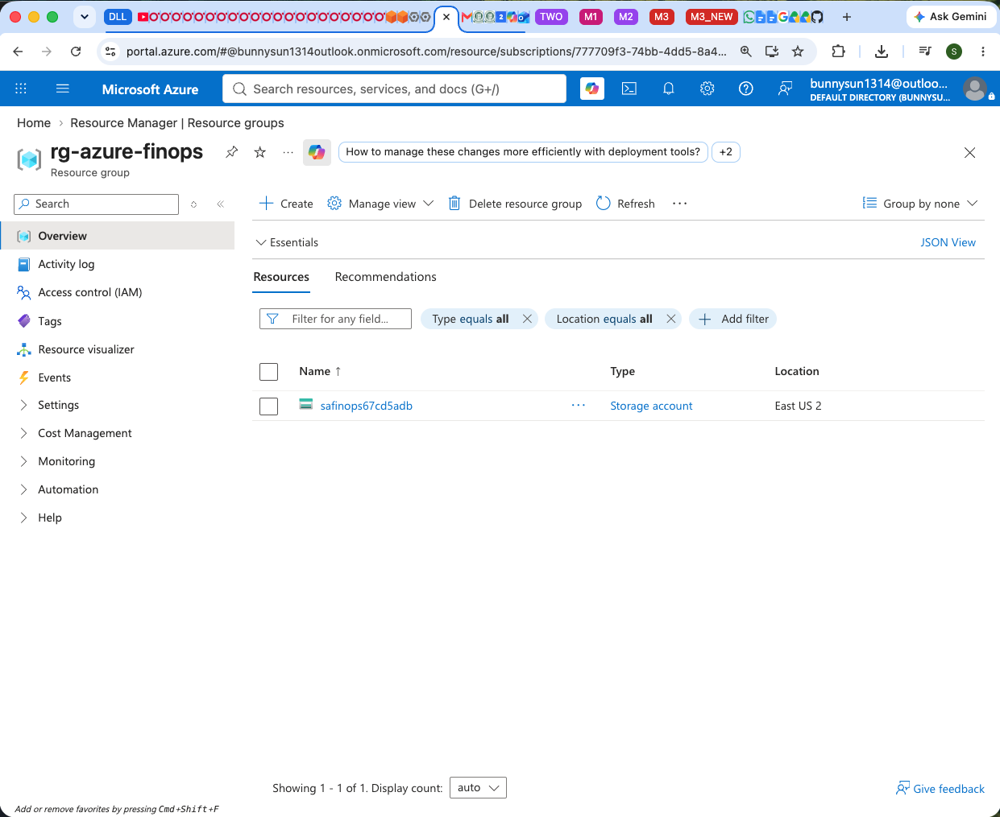

# <span style="color:red">❓ 7. Frequently Asked Questions (FAQ)</span> <span style="font-size: 14px; font-weight: normal;">[⬆️ Back to TOC](README.md#toc)</span>

🔹 **Q1. What is the difference between a Management Group and a Subscription?**

**Answer:** 
A Subscription is the primary billing boundary in Azure. A Management Group is a hierarchical container that sits above Subscriptions. By placing multiple Subscriptions into a single Management Group, you can apply a single Azure Policy or Budget at the Management Group level, and it will instantly cascade down to govern every underlying subscription simultaneously.

🔹 **Q2. How do Azure Policies prevent cost overruns before they happen?**

**Answer:** 
Unlike budget alerts (which notify you **after** money has been spent), Azure Policy acts as a preventative guardrail. It intercepts the deployment request in real-time. If the requested resource violates the policy (e.g., trying to deploy an expensive GPU VM when only cheap VMs are allowed), Azure instantly rejects the deployment with a "Deny" error.

🔹 **Q3. Why is it important to enforce tagging via Azure Policy?**

**Answer:** 
Without tags, it is nearly impossible to figure out which department or project is responsible for a massive Azure bill. By enforcing a `CostCenter` or `Department` tag at deployment time via Azure Policy, you guarantee 100% accurate cost allocation in your billing reports, because developers are physically prevented from deploying untagged, untrackable resources.

🔹 **Q4. What happens to a Subscription when its Management Group is deleted?**

**Answer:** 
Deleting a Management Group does not delete the Subscriptions inside it. It simply breaks the hierarchical link (the parent-child relationship). The Subscriptions are essentially "un-parented" and will automatically fall back to the default Tenant Root Group. No resources inside the Subscription are harmed or deleted.

🔹 **Q5. How long does it take for tags to show up in Azure Cost Analysis?**

**Answer:** 
After you tag a resource, it can take anywhere from 8 to 24 hours for the new tags to propagate and appear in the Azure Cost Management + Billing reports. Cost data is not perfectly real-time; it is processed in batches by Microsoft's backend billing engine.

🔹 **Q6. Why is there only a Storage Account inside the deployed Resource Group? Where are the FinOps resources?**



**Answer:** 
The core of this project is deploying invisible enterprise guardrails rather than a massive application. The physical resources (the Storage Account) are just dummies used for testing. The true FinOps infrastructure (the Azure Policies and the Consumption Budget) is deployed at the **Management Group** level, which sits completely outside and above your Resource Groups. To view them, you must search for "Management Groups", "Policy", or "Cost Management + Billing" in the Azure Portal search bar, rather than looking inside the Resource Group.

🔹 **Q7. Can I use the Azure CLI to list these invisible Management Group resources?**

**Answer:** 
Yes! Because these resources sit above standard Resource Groups, you must target the specific Management Group scope. Run the following commands in your terminal:

**View the Management Group:**
```bash
az account management-group list -o table
```

**View the Azure Policy Guardrails assigned to it:**
```bash
az policy assignment list --scope "/providers/Microsoft.Management/managementGroups/MG-FinOps" --query "[].{Name:displayName, PolicyId:policyDefinitionId}" -o table
```

**View the rolling Consumption Budget:**
```bash
az consumption budget list --scope "/providers/Microsoft.Management/managementGroups/MG-FinOps" --query "[].{Name:name, Amount:amount, TimeGrain:timeGrain}" -o table
```

🔹 **Q8. What does the raw JSON payload of an Azure Policy Assignment look like?**

**Answer:** 
When you assign a policy, Azure generates a full JSON object containing the scope, the policy definition ID, and the parameters. Here are the complete JSON payloads for the three guardrails deployed in this project:

**1. Allowed VM SKUs Assignment**
```json
{
  "definitionVersion": "1.*.*",
  "description": "Assignment of Allowed VM SKUs",
  "displayName": "Assign Allowed VM SKUs",
  "enforcementMode": "Default",
  "id": "/providers/Microsoft.Management/managementGroups/MG-FinOps/providers/Microsoft.Authorization/policyAssignments/assign-vm-skus",
  "name": "assign-vm-skus",
  "parameters": {
    "listOfAllowedSKUs": {
      "value": [
        "Standard_B2s",
        "Standard_D2s_v3"
      ]
    }
  },
  "policyDefinitionId": "/providers/Microsoft.Management/managementGroups/MG-FinOps/providers/Microsoft.Authorization/policyDefinitions/policy-allowed-vm-skus",
  "scope": "/providers/Microsoft.Management/managementGroups/MG-FinOps",
  "type": "Microsoft.Authorization/policyAssignments"
}
```

**2. Allowed Storage SKUs Assignment**
```json
{
  "definitionVersion": "1.*.*",
  "description": "Assignment of Allowed Storage SKUs",
  "displayName": "Assign Allowed Storage SKUs",
  "enforcementMode": "Default",
  "id": "/providers/Microsoft.Management/managementGroups/MG-FinOps/providers/Microsoft.Authorization/policyAssignments/assign-storage-skus",
  "name": "assign-storage-skus",
  "parameters": {
    "listOfAllowedSKUs": {
      "value": [
        "Standard_LRS"
      ]
    }
  },
  "policyDefinitionId": "/providers/Microsoft.Management/managementGroups/MG-FinOps/providers/Microsoft.Authorization/policyDefinitions/policy-allowed-storage-skus",
  "scope": "/providers/Microsoft.Management/managementGroups/MG-FinOps",
  "type": "Microsoft.Authorization/policyAssignments"
}
```

**3. Require CostCenter Tag Assignment**
```json
{
  "definitionVersion": "1.*.*",
  "description": "Require CostCenter tag on resources",
  "displayName": "Assign Require Tag",
  "enforcementMode": "Default",
  "id": "/providers/Microsoft.Management/managementGroups/MG-FinOps/providers/Microsoft.Authorization/policyAssignments/assign-require-tag",
  "name": "assign-require-tag",
  "parameters": {
    "tagName": {
      "value": "CostCenter"
    }
  },
  "policyDefinitionId": "/providers/Microsoft.Management/managementGroups/MG-FinOps/providers/Microsoft.Authorization/policyDefinitions/policy-require-tag",
  "scope": "/providers/Microsoft.Management/managementGroups/MG-FinOps",
  "type": "Microsoft.Authorization/policyAssignments"
}
```

🔹 **Q9. How can I create these exact policy assignments using the Azure CLI?**

**Answer:** 
If you want to bypass Terraform and create these assignments directly from the terminal, you can use the `az policy assignment create` command. Notice how the JSON parameters from Q8 are passed directly into the `--params` flag!

**1. Assign Allowed VM SKUs**
```bash
az policy assignment create \
  --name "assign-vm-skus" \
  --display-name "Assign Allowed VM SKUs" \
  --policy "/providers/Microsoft.Management/managementGroups/MG-FinOps/providers/Microsoft.Authorization/policyDefinitions/policy-allowed-vm-skus" \
  --scope "/providers/Microsoft.Management/managementGroups/MG-FinOps" \
  --params '{"listOfAllowedSKUs": {"value": ["Standard_B2s", "Standard_D2s_v3"]}}'
```

**2. Assign Allowed Storage SKUs**
```bash
az policy assignment create \
  --name "assign-storage-skus" \
  --display-name "Assign Allowed Storage SKUs" \
  --policy "/providers/Microsoft.Management/managementGroups/MG-FinOps/providers/Microsoft.Authorization/policyDefinitions/policy-allowed-storage-skus" \
  --scope "/providers/Microsoft.Management/managementGroups/MG-FinOps" \
  --params '{"listOfAllowedSKUs": {"value": ["Standard_LRS"]}}'
```

**3. Assign Require CostCenter Tag**
```bash
az policy assignment create \
  --name "assign-require-tag" \
  --display-name "Assign Require Tag" \
  --policy "/providers/Microsoft.Management/managementGroups/MG-FinOps/providers/Microsoft.Authorization/policyDefinitions/policy-require-tag" \
  --scope "/providers/Microsoft.Management/managementGroups/MG-FinOps" \
  --params '{"tagName": {"value": "CostCenter"}}'
```

🔹 **Q10. In a policy denial error, why does the error message explicitly list the resource name (like `Target: vm-expensive-test`)? Is this a built-in feature?**

**Answer:** 
Yes, this is a built-in feature of Azure Policy's "pre-flight validation" engine! Here is exactly how Azure Policy evaluates resources behind the scenes:

1. **Interception:** When you run `az vm create`, the request goes to the Azure Resource Manager (ARM). Before ARM actually builds anything, it intercepts the JSON payload of your proposed deployment.
2. **Evaluation:** ARM scans the proposed properties of your resource (like its name `vm-expensive-test`, its size `Standard_E2s_v3`, and the fact that it is missing a `CostCenter` tag) and compares them against all the Azure Policies assigned to your Management Group.
3. **Rejection:** As soon as ARM realizes the proposed size (`Standard_E2s_v3`) violates the Allowed VM SKUs policy, it completely halts the deployment **before** it starts and generates a `PolicyViolation` report.

In that report, Azure explicitly lists the target resource name so the developer reading the error log knows **exactly** which resource in their deployment template caused the failure. This is incredibly helpful when you are deploying a template with dozens of resources at once!

🔹 **Q11. Why do the Azure CLI test commands use a `${RANDOM}` variable in the resource names (e.g., `saexpensivetest${RANDOM}`)?**

**Answer:** 
`${RANDOM}` is a built-in variable in `bash` and `zsh` (the default terminal shells on macOS and Linux) that generates a random number between 0 and 32767. 

We must use it here because Azure Storage Accounts have a strict global naming requirement: **The name must be globally unique across all of Azure.** If you try to create a storage account with a static name like `saexpensivetest`, there is a high chance someone else in the world has already taken it. If that happens, Azure will reject your command with a "Name already taken" error, meaning your deployment would fail **before** it even reaches the Policy Evaluation phase! 

By appending `${RANDOM}` (e.g., `saexpensivetest28491`), we guarantee the name is unique. This ensures the request makes it past Azure's basic name validation and successfully hits our FinOps Policy Guardrails, which is exactly what we are trying to test.

🔹 **Q12. What exactly happens behind the scenes when I run `terraform destroy` for this FinOps project?**

**Answer:** 
When you execute `terraform destroy` for this architecture, Terraform intelligently reverses the setup process. Here are the three key things to note about the destruction phase:

1. **No Rogue Resources:** Because your Azure Policy guardrails successfully blocked all of your CLI test deployments (like the expensive VM and un-tagged Storage Account), there are no hidden resources eating up costs. Terraform only has to destroy exactly what it built!
2. **Subscription Re-parenting:** Terraform won't delete your actual Azure Subscriptions. Instead, it destroys the `azurerm_management_group_subscription_association` resources, which safely un-links your subscriptions from the `MG-FinOps` Management Group and returns them to your Azure Tenant Root Group.
3. **Patience with Management Groups:** Azure's backend can sometimes be slightly slow when deleting Management Groups because it must deeply verify that absolutely no subscriptions are left attached to it. If the destroy command seems to hang for 1-2 minutes on the `azurerm_management_group` resource, do not panic or cancel the command—that is completely normal Azure validation behavior!

🔹 **Q13. Can I use the Azure Resource Visualizer to map out the resources created in this project?**

**Answer:** 
No, the Azure Resource Visualizer actually won't be very useful for this specific project! 

Here is why:
Azure's Resource Visualizers are specifically designed to map out **infrastructure topologies** (e.g., Virtual Networks, Subnets, Virtual Machines, Load Balancers, and how they physically connect to each other).

However, in this project:
1. **We built Governance Controls, not Infrastructure:** The resources Terraform deployed (Management Groups, Policy Definitions, Policy Assignments, and Budgets) all exist at the Azure control plane level. They are invisible governance constructs that sit above your subscriptions, so they do not show up in standard topology visualizers.
2. **Our Infrastructure was Blocked:** We **tried** to deploy infrastructure (a VM and a Storage Account) during the testing phase, but our Policy guardrails successfully blocked them! Because they were never created, there is nothing for the visualizer to map.

If you want to "visualize" this architecture, the best way is to look at the **Management Groups** hierarchy view in the Azure Portal, or check the **Policy -> Assignments** dashboard to see your guardrails layered over your subscriptions.
