# 💰 Azure FinOps and Cloud Cost Management

This project demonstrates how to implement enterprise **Azure FinOps** and proactive cost governance using **Terraform**. It establishes a centralized governance hierarchy using **Azure Management Groups**, multi-subscription scoping, automated **Azure Consumption Budgets**, and proactive **Azure Policy Guardrails**. By shifting cost management left, it physically prevents accidental over-provisioning and unallocated cloud spend before resources are ever deployed.

## <span id="toc"></span>📑 Table Of Contents (TOC)

- [0. Pre-requisite Software](#prerequisites)
- [1. Architecture Overview & FinOps Principles](#finops-concepts)
  - [1.1 Architecture & Governance Topology](#arch-topology)
  - [1.2 The "Why": Architectural Rationale & Proactive Guardrails](#why-rationale)
  - [1.3 Resource Tagging & Hierarchical Tracking](#tagging-hierarchy)
- [2. Directory Structure](#folder-structure)
- [3. Environment Setup](#env-setup)
- [4. Deploy the Infrastructure](#deploy-infra)
- [5. Test Cost Guardrails (Azure Policy)](#test-deployment)
  - [5.1 Test: Block Expensive Virtual Machines](#test-vm-block)
  - [5.2 Test: Block Expensive Storage Accounts](#test-storage-block)
  - [5.3 Test: Enforce Mandatory Tagging](#test-tag-enforce)
  - [5.4 View Budget Alert on Management Group](#view-budgets)
- [6. Clean Up](#cleanup)
- [7. Frequently Asked Questions (FAQ)](FAQ.md)
- [8. Troubleshooting Guide](TROUBLESHOOTING.md)

---

## <span id="prerequisites"></span><span style="color:red">⚙️ 0. Pre-requisite Software</span> <span style="font-size: 14px; font-weight: normal;">[⬆️ Back to TOC](#toc)</span>

Ensure you have the following software installed before proceeding:

- **Azure CLI**: To authenticate with your Azure subscription and manage cloud resources. Download and install from [Azure CLI Official Website](https://learn.microsoft.com/en-us/cli/azure/install-azure-cli).

  ```bash
  az --version
  ```

- **Terraform**: Infrastructure as Code tool to deploy the Azure resources. Download and install from [HashiCorp Official Website](https://developer.hashicorp.com/terraform/downloads).

  ```bash
  terraform --version
  ```

---

## <span id="finops-concepts"></span><span style="color:red">🧠 1. Architecture Overview & FinOps Principles</span> <span style="font-size: 14px; font-weight: normal;">[⬆️ Back to TOC](#toc)</span>

### <span id="arch-topology"></span>💡 1.1 Architecture & Governance Topology <span style="font-size: 14px; font-weight: normal;">[⬆️ Back to TOC](#toc)</span>

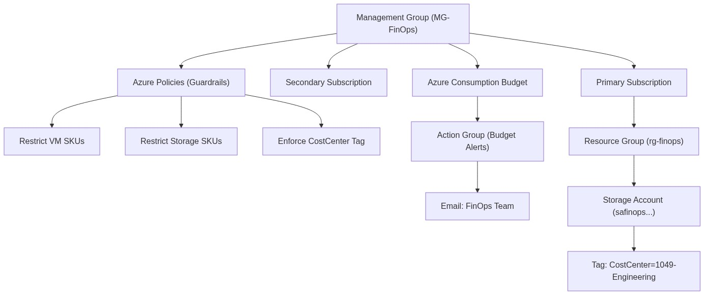

### <span id="why-rationale"></span>💡 1.2 The "Why": Architectural Rationale & Proactive Guardrails <span style="font-size: 14px; font-weight: normal;">[⬆️ Back to TOC](#toc)</span>

Traditional cloud cost management is **reactive**: finance teams receive an exorbitant bill at month-end, investigate the root cause days later, and scramble to shut down forgotten resources after the money is already spent.

This architecture implements the core pillars of the **FinOps Foundation (Inform, Optimize, Operate)** by replacing reactive post-mortems with real-time proactive policy guardrails:

- **Why Proactive Azure Policy over Reactive Budgets?** While Azure Budgets alert administrators after consumption thresholds are crossed, Azure Policy intercepts ARM API deployment requests in real-time. If an engineer or pipeline attempts to provision an unapproved, expensive VM SKU (e.g., `Standard_E2s_v3`) or geo-redundant storage (`Standard_GRS`), Azure immediately issues an HTTP 403 RequestDisallowedByPolicy error, blocking the financial drain before a single cent is billed.
- **Why Management Groups over Subscription-Level Controls?** In enterprise multi-cloud setups, applying governance subscription-by-subscription leads to configuration drift. Placing multiple subscriptions under an enterprise Management Group (`MG-FinOps`) ensures that policies, budgets, and compliance rules cascade down instantly and inherit automatically across all current and future child subscriptions.
- **Why Mandatory Tagging via Policy?** Unallocated cloud spend is the number one obstacle in cloud financial accounting. Enforcing a required `CostCenter` tag at the Azure Policy layer guarantees that no resource can physically be created unless it is linked to a financial cost center, delivering 100% cost transparency in Azure Cost Analysis and billing reports.

### <span id="tagging-hierarchy"></span>🏷️ 1.3 Resource Tagging & Hierarchical Tracking <span style="font-size: 14px; font-weight: normal;">[⬆️ Back to TOC](#toc)</span>

- **Management Group**: Governs overall spending caps (e.g., $1000/month rolling budget) and enterprise policy guardrails across all linked subscriptions.
- **Subscriptions**: Act as primary billing containers (e.g., Primary and Secondary project subscriptions).
- **Resource Groups**: Application-level boundaries (`rg-finops`) containing functional workloads.
- **Granular Tags**: Key-value pairs (`CostCenter: 1049-Engineering`) attached to individual cloud resources to enable multi-dimensional cost slicing, showback, and chargeback accounting.

---

## <span id="folder-structure"></span><span style="color:red">📂 2. Directory Structure</span> <span style="font-size: 14px; font-weight: normal;">[⬆️ Back to TOC](#toc)</span>

```text
Project_27_Azure_FinOps/
├── images/                                                      # Project architecture diagrams
│   └── architecture.png                                         # Visual architecture diagram
├── terraform/                                                   # Infrastructure as Code
│   ├── main.tf                                                  # Management Group, Policies, and Budget configurations
│   ├── outputs.tf                                               # Management Group ID and Budget outputs
│   └── variables.tf                                             # Subscription, region, and alert email variables
├── .env.example                                                 # Template for environment variables
├── azure_storage_account_create_policy_denied_error.txt         # Terminal log of Policy Deny error on Storage SKU
├── azure_storage_account_create_policy_require_tag_error.txt    # Terminal log of Policy Deny error on missing CostCenter tag
├── azure_vm_create_policy_denied_error.txt                      # Terminal log of Policy Deny error on expensive VM SKU
├── FAQ.md                                                       # Frequently Asked Questions
├── README.md                                                    # Project documentation
└── TROUBLESHOOTING.md                                           # Troubleshooting guide and error resolutions
```

---

## <span id="env-setup"></span><span style="color:red">⚙️ 3. Environment Setup</span> <span style="font-size: 14px; font-weight: normal;">[⬆️ Back to TOC](#toc)</span>

### 3.1. Set up your environment variables:

Copy `.env.example` to `.env` and fill in your primary and secondary Subscription IDs, along with your alert email address:

```bash
# Ensure you are at the project root before starting
cp .env.example .env
```

### 3.2. Authenticate with Azure:

Authenticate your terminal to Azure so Terraform and the CLI can deploy resources:

```bash
az login
```

---

## <span id="deploy-infra"></span><span style="color:red">🚀 4. Deploy the Infrastructure</span> <span style="font-size: 14px; font-weight: normal;">[⬆️ Back to TOC](#toc)</span>

This will deploy the FinOps Management Group, attach your subscriptions, set up the Budget Alerts, and enforce the Azure Policy guardrails:

```bash
# Ensure you are at the project root before starting
cd terraform

# Export variables from .env to your shell session safely
set -a; source ../.env; set +a

terraform init
terraform apply \
  -var="resource_group=${RESOURCE_GROUP_NAME}" \
  -var="location=${LOCATION}" \
  -var="primary_subscription_id=${PRIMARY_SUBSCRIPTION_ID}" \
  -var="secondary_subscription_id=${SECONDARY_SUBSCRIPTION_ID}" \
  -var="alert_email_address=${ALERT_EMAIL_ADDRESS}" \
  -auto-approve

cd ..
```

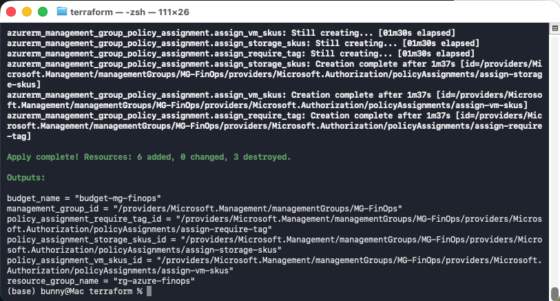


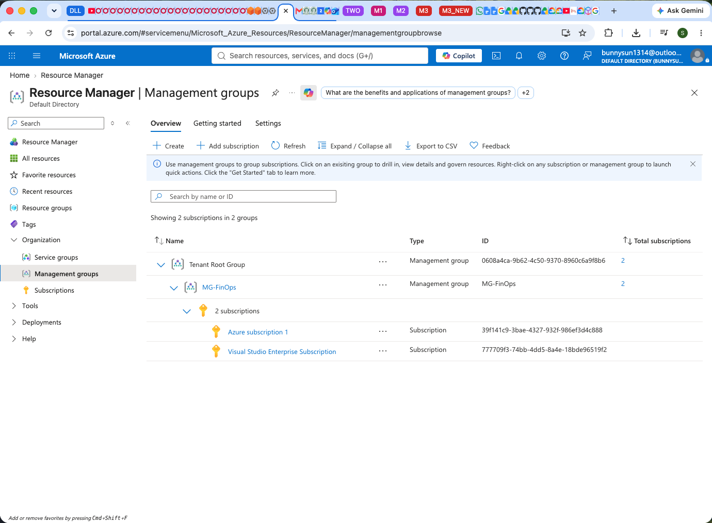

To reach the above Management Group overview screen, type `management group` in the Azure Portal search bar.

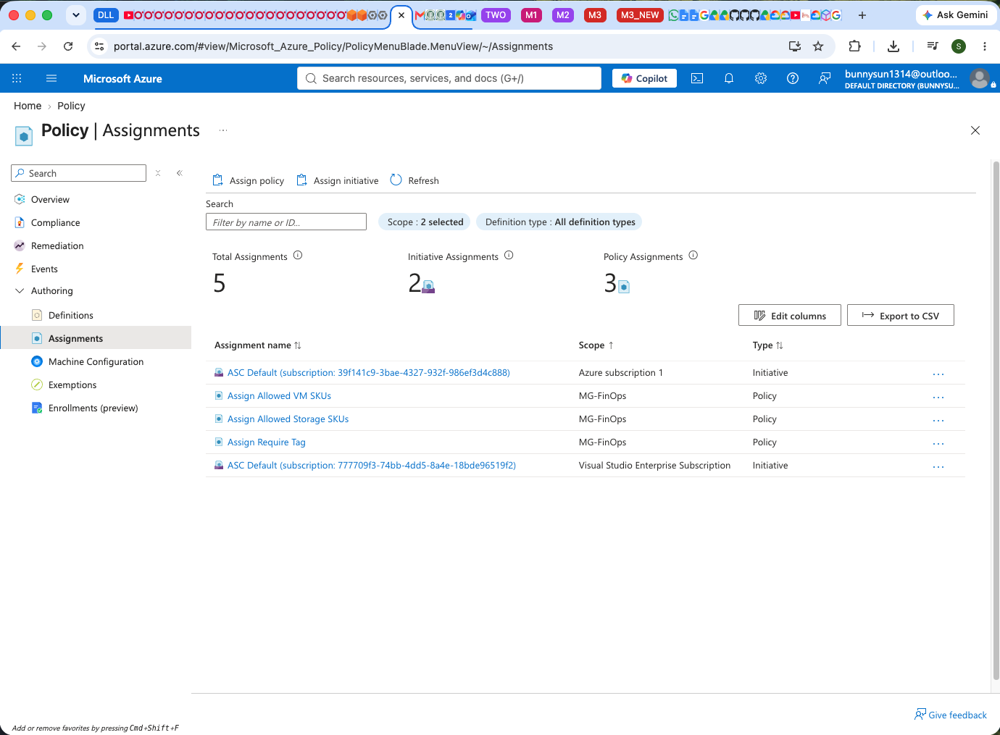

To reach the above Policy overview screen, type `policy` in the Azure Portal search bar.

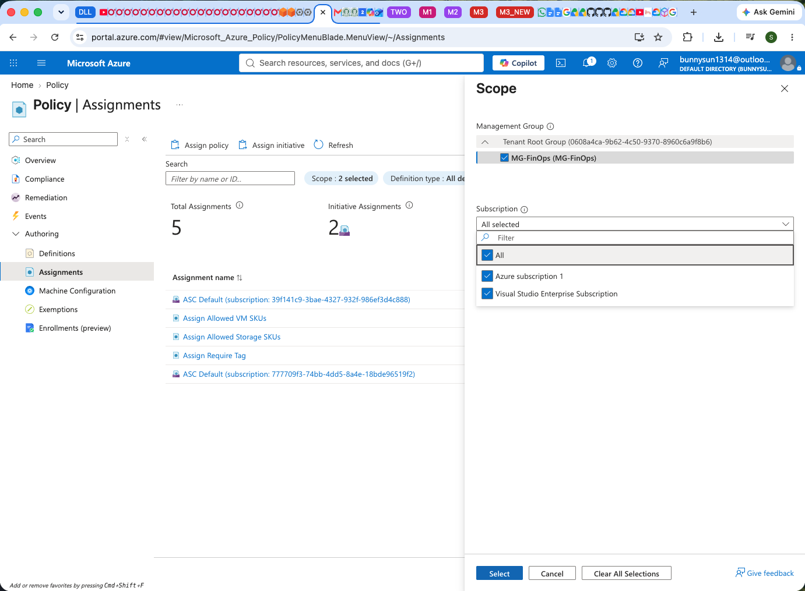

Ensure the correct scope is selected. In this case, view the policies implemented at the `Management Group` scope.

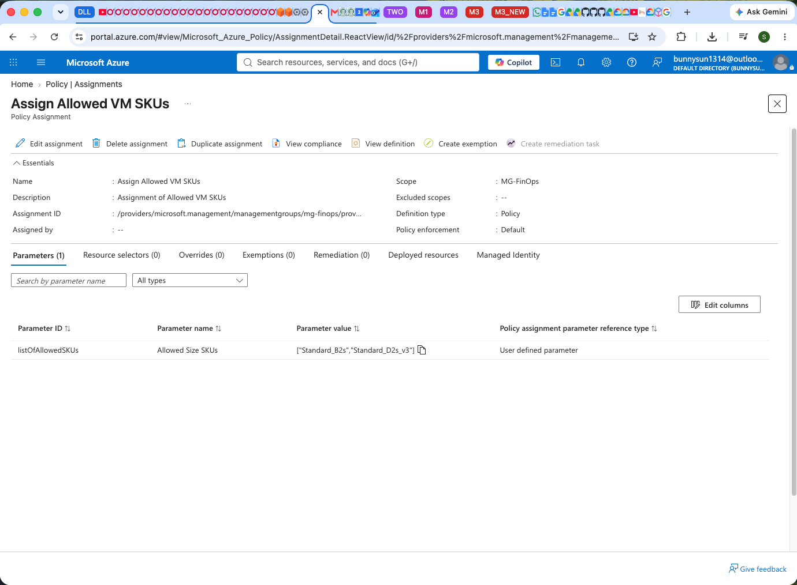

Assignment ID:
`/providers/microsoft.management/managementgroups/mg-finops/providers/microsoft.authorization/policyassignments/assign-vm-skus`

Parameter values:
`["Standard_B2s","Standard_D2s_v3"]`

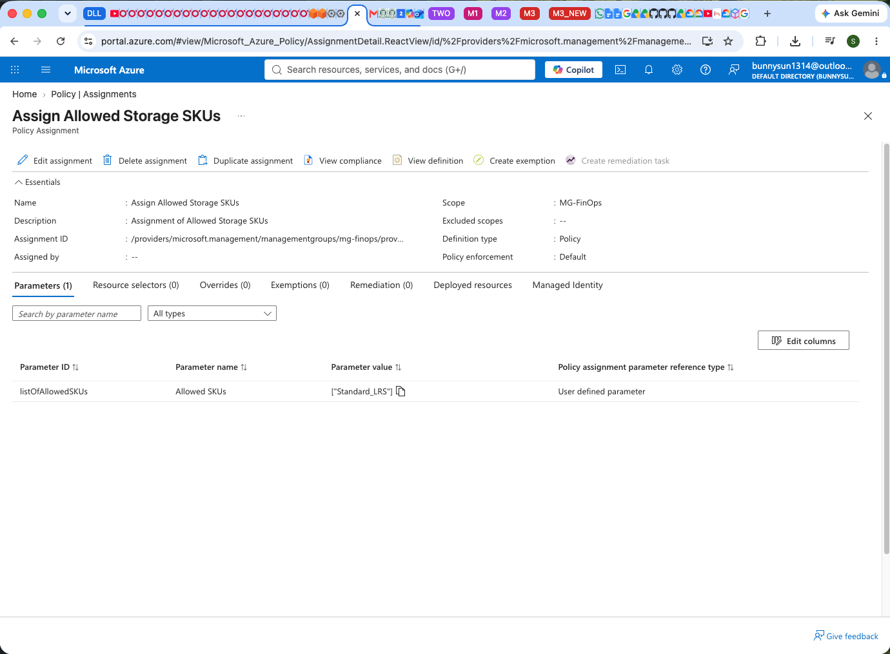

Assignment ID:
`/providers/microsoft.management/managementgroups/mg-finops/providers/microsoft.authorization/policyassignments/assign-storage-skus`

Parameter values:
`["Standard_LRS"]`

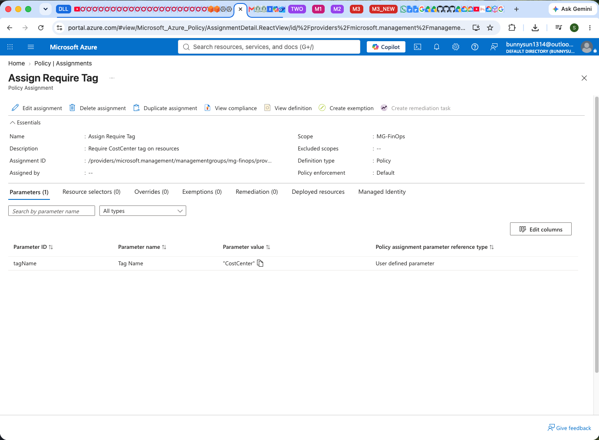

Assignment ID:
`/providers/microsoft.management/managementgroups/mg-finops/providers/microsoft.authorization/policyassignments/assign-require-tag`

Parameter value:
`{"tagName": "CostCenter"}`

---

## <span id="test-deployment"></span><span style="color:red">🔍 5. Test Cost Guardrails (Azure Policy)</span> <span style="font-size: 14px; font-weight: normal;">[⬆️ Back to TOC](#toc)</span>

### <span id="test-vm-block"></span>🌐 5.1 Test: Block Expensive Virtual Machines <span style="font-size: 14px; font-weight: normal;">[⬆️ Back to TOC](#toc)</span>

Our Azure Policy restricts VMs to cheap SKUs (`Standard_B2s` or `Standard_D2s_v3`). Let's attempt to deploy an expensive memory-optimized VM (`Standard_E2s_v3`) to prove the policy blocks it.

```bash
# Ensure you are at the project root before starting
set -a; source .env; set +a

# This command should fail with a Policy Deny error!
az vm create \
  --resource-group ${RESOURCE_GROUP_NAME} \
  --name "vm-expensive-test" \
  --image Ubuntu2204 \
  --size "Standard_E2s_v3" \
  --generate-ssh-keys
```

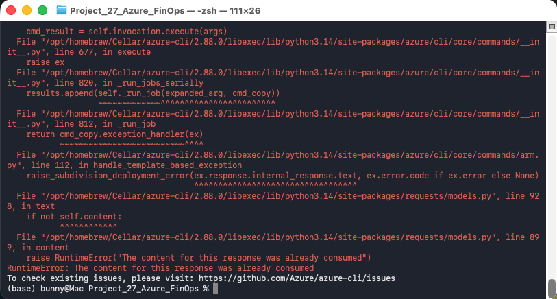

**Expected Result**: The deployment will be <span style="color:red; font-size: 18px; font-weight: bold">explicitly denied</span> by the `policy-allowed-vm-skus` guardrail.

Please refer to the file [azure_vm_create_policy_denied_error.txt](azure_vm_create_policy_denied_error.txt) for more details.

### <span id="test-storage-block"></span>🌐 5.2 Test: Block Expensive Storage Accounts <span style="font-size: 14px; font-weight: normal;">[⬆️ Back to TOC](#toc)</span>

We restricted Storage Accounts to `Standard_LRS`. Let's attempt to deploy an expensive Geo-Redundant storage account (`Standard_GRS`).

```bash
# Ensure you are at the project root before starting
set -a; source .env; set +a

# This command should fail with a Policy Deny error!
az storage account create \
  --name "saexpensivetest${RANDOM}" \
  --resource-group ${RESOURCE_GROUP_NAME} \
  --sku Standard_GRS
```

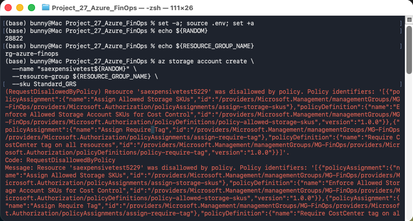

**Expected Result**: The deployment will be <span style="color:red; font-size: 18px; font-weight: bold">explicitly denied</span> by the `policy-allowed-storage-skus` guardrail.

Please refer to the file [azure_storage_account_create_policy_denied_error.txt](azure_storage_account_create_policy_denied_error.txt) for more details.

### <span id="test-tag-enforce"></span>🌐 5.3 Test: Enforce Mandatory Tagging <span style="font-size: 14px; font-weight: normal;">[⬆️ Back to TOC](#toc)</span>

Every resource must have a `CostCenter` tag for proper billing allocation. Let's attempt to create a valid `Standard_LRS` storage account, but **without** the required tag.

```bash
# Ensure you are at the project root before starting
set -a; source .env; set +a

# This command should fail with a Policy Deny error!
az storage account create \
  --name "satagtest${RANDOM}" \
  --resource-group ${RESOURCE_GROUP_NAME} \
  --sku Standard_LRS
```

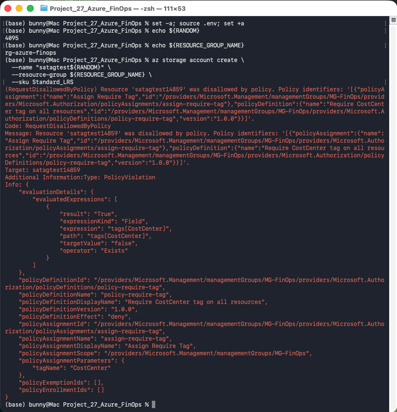

**Expected Result**: Even though the SKU is allowed, the deployment will be <span style="color:red; font-size: 18px; font-weight: bold">explicitly denied</span> by the `policy-require-tag` guardrail because it is missing the `CostCenter` tag.

Please refer to the file [azure_storage_account_create_policy_require_tag_error.txt](azure_storage_account_create_policy_require_tag_error.txt) for more details.

### <span id="view-budgets"></span>🌐 5.4 View Budget Alert on Management Group <span style="font-size: 14px; font-weight: normal;">[⬆️ Back to TOC](#toc)</span>

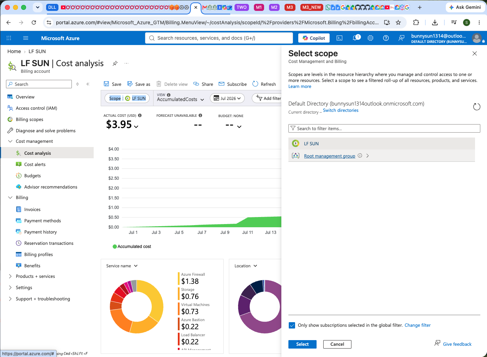

📝 Note: By default, Azure will show you your Subscription or Billing Account. You need to change this to your Management Group!

1. Click `Root management group` on the right panel.

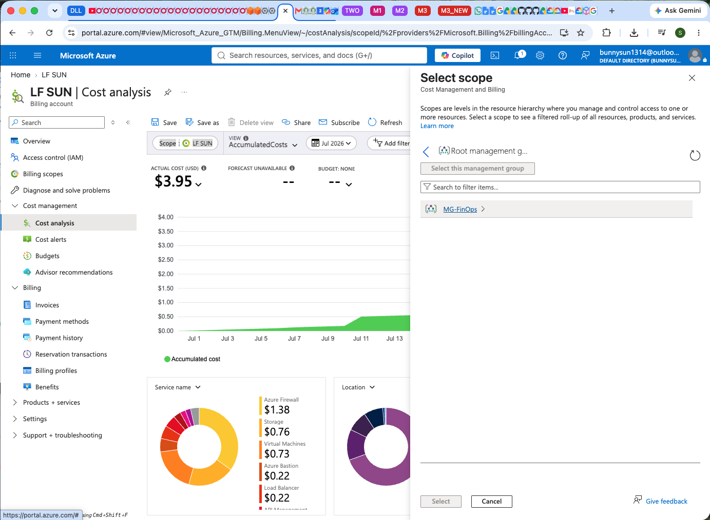

2. Click `MG-FinOps` on the right panel.

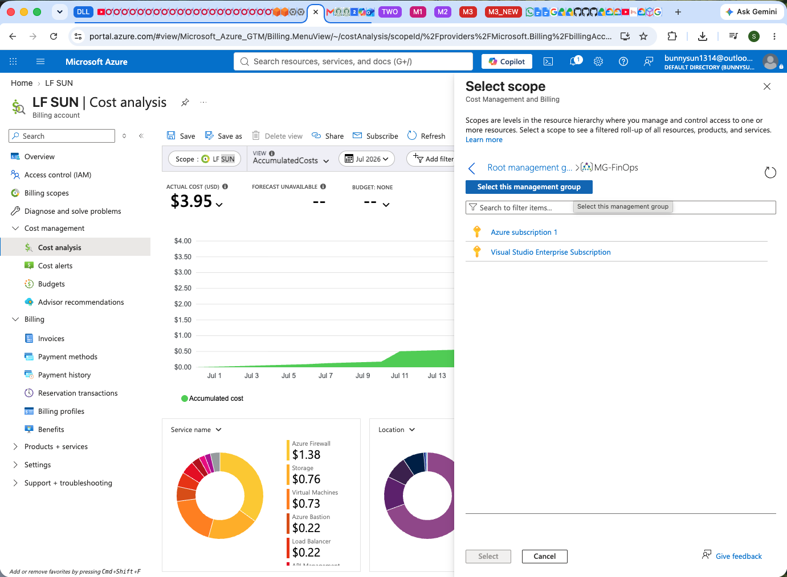

3. Click the `Select this management group` blue button on the right panel.

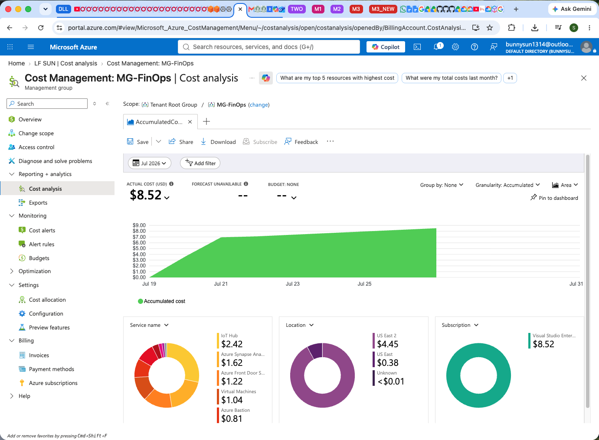

4. Click `Budgets` on the left sidebar.

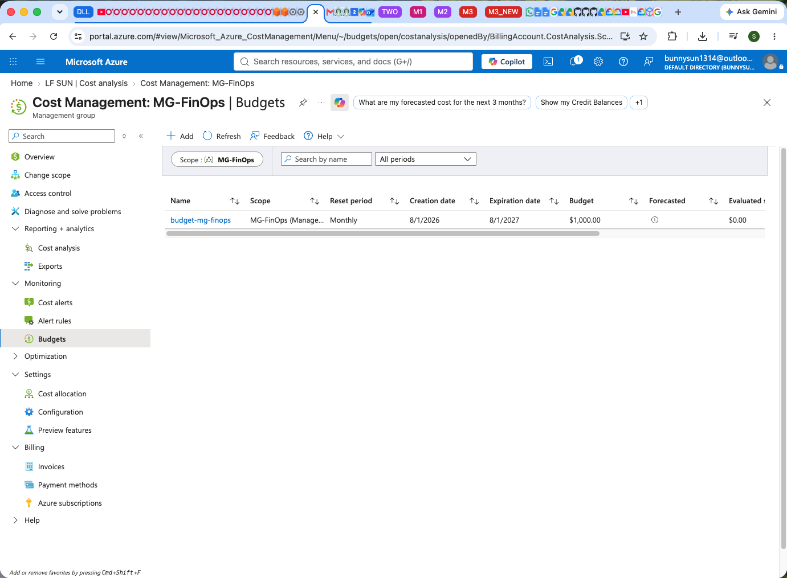

5. Click the `budget-mg-finops` budget.

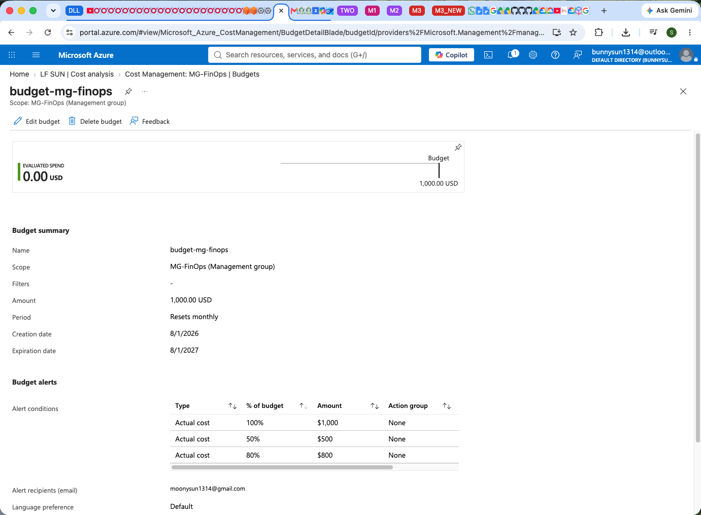

Inside the budget details, you will see exactly what Terraform built:
- **Budget Amount**: The total budget limit (1,000 units).
- **Evaluation Condition**: The trigger configured to alert when actual spend is > 50%.
- **Alert Recipients**: The exact email address you provided via your `.env` file!

```hcl
# -----------------------------------------------------------------------------
# Cost Alerts and Budgets
# -----------------------------------------------------------------------------
resource "azurerm_consumption_budget_management_group" "mg_budget" {
  name                = "budget-mg-finops"
  management_group_id = azurerm_management_group.finops_mg.id

  amount     = 1000
  time_grain = "Monthly"

  time_period {
    start_date = "2026-08-01T00:00:00Z"
    end_date   = "2027-08-01T00:00:00Z"
  }

  notification {
    enabled        = true
    threshold      = 50.0
    operator       = "GreaterThan"
    contact_emails = [var.alert_email_address]
  }

  notification {
    enabled        = true
    threshold      = 80.0
    operator       = "GreaterThan"
    contact_emails = [var.alert_email_address]
  }

  notification {
    enabled        = true
    threshold      = 100.0
    operator       = "GreaterThan"
    contact_emails = [var.alert_email_address]
  }
}
```

---

## <span id="cleanup"></span><span style="color:red">🧹 6. Clean Up</span> <span style="font-size: 14px; font-weight: normal;">[⬆️ Back to TOC](#toc)</span>

To avoid unwanted cloud billing and remove the Management Group structure:

```bash
# Ensure you are at the project root before starting
cd terraform

# Export variables from .env to your shell session safely
set -a; source ../.env; set +a

terraform destroy \
  -var="resource_group=${RESOURCE_GROUP_NAME}" \
  -var="location=${LOCATION}" \
  -var="primary_subscription_id=${PRIMARY_SUBSCRIPTION_ID}" \
  -var="secondary_subscription_id=${SECONDARY_SUBSCRIPTION_ID}" \
  -var="alert_email_address=${ALERT_EMAIL_ADDRESS}" \
  -auto-approve

cd ..
```
